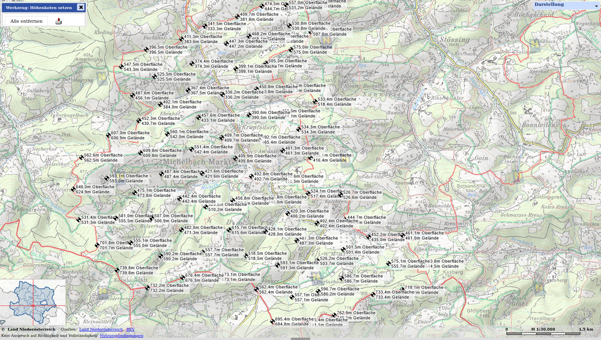

# GK M34 to wavefront `.obj`

## Simple scripts to turn GK M34 Heightmap files into wavefront `.obj` files

| Input                                                        | Output                                                               |
| ------------------------------------------------------------ | -------------------------------------------------------------------- |
|  |  |

Prerequisites:

- `node`

Usage:

```
$ ./gkm34_to_wavefront.js inputGkm34.txt output.obj
$ ./wavefront_normalize.js output.obj output_normalized.obj
```

Example sources for GK M34 files:

- https://atlas.noe.gv.at/
